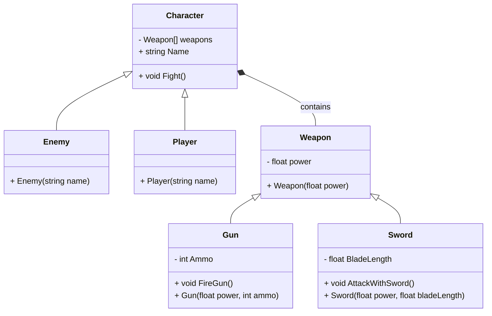

```mermaid
classDiagram
    class Character {
        - Weapon[] weapons
        + string Name
        + void Fight()
    }

    class Enemy {
        + Enemy(string name)
    }

    class Player {
        + Player(string name)
    }

    class Weapon {
        - float power
        + Weapon(float power)
    }

    class Gun {
        - int Ammo
        + void FireGun()
        + Gun(float power, int ammo)
    }

    class Sword {
        - float BladeLength
        + void AttackWithSword()
        + Sword(float power, float bladeLength)
    }

    Character <|-- Enemy
    Character <|-- Player
    Character *-- Weapon : contains
    Weapon <|-- Gun
    Weapon <|-- Sword
```